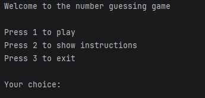
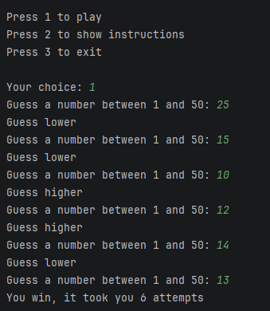
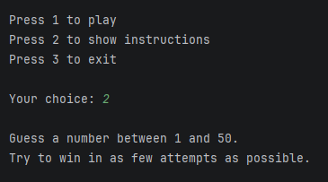
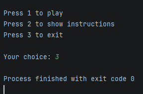

# Number Guessing Game

A simple command-line number guessing game built in Python.

The player must guess a randomly generated number between 1 and 50 in as few attempts as possible.

---

## How to Play

1. Run the program
2. Choose an option from the menu:
   - Play the game
   - View instructions
   - Exit
3. Try to guess the secret number!

---

## Features

- Random number generation (1–50)
- Input validation (handles invalid inputs)
- Attempt counter
- Higher/lower hints
- Simple menu system
- Replayable gameplay loop

---

## How It Works

The program generates a random number using Python’s `random` module.

The player keeps guessing until they find the correct number, while receiving hints after each attempt.

---

## Screenshots

### Main menu


### Gameplay


### Instructions


### Quit game


## Run the Project

```bash
python main.py
